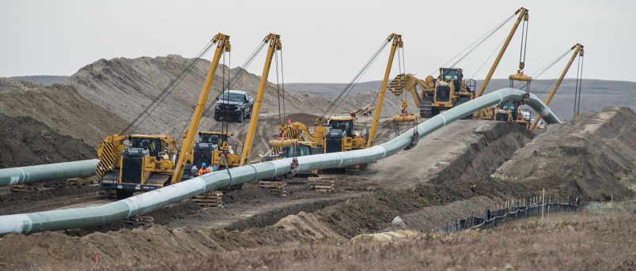

"Être dans l'pipe" c'est le moment pendant lequel le code est testé. C'est une étape clef du CI (l'intégration continue). Dès qu'une contribution est poussée vers un dépôt, elle est automatiquement soumise à une série de tests. On dit alors qu'elle est dans le pipe (prononcer à l'américaine le paillepe). En général les opérations qui se succèdent sont des simulations de compilation et de déploiement. Pendant tout ce temps, le gentil développeur ne peut rien faire d'autre qu'attendre. D'où l'expression "j'suis dans l'pipe là"...

🤖